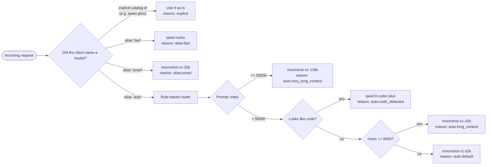
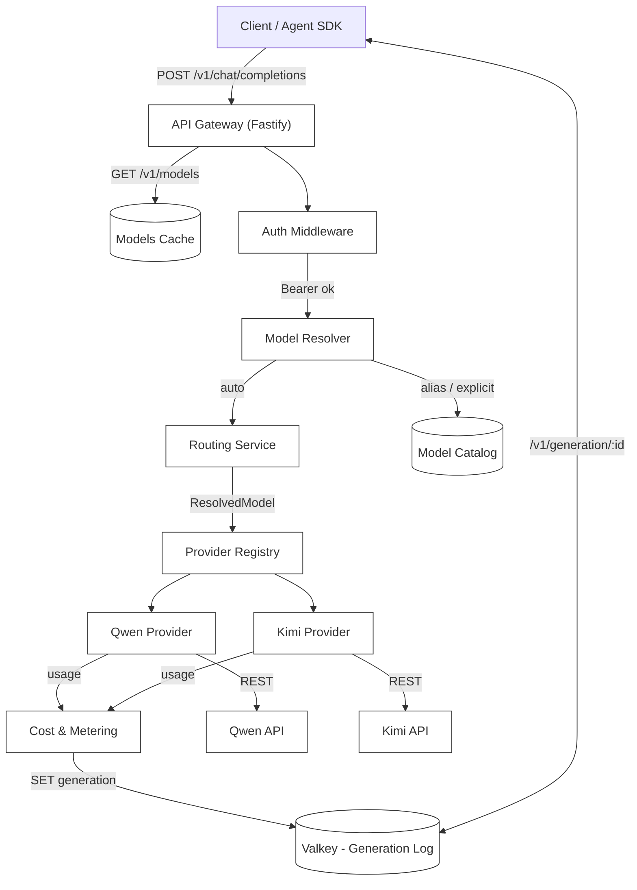
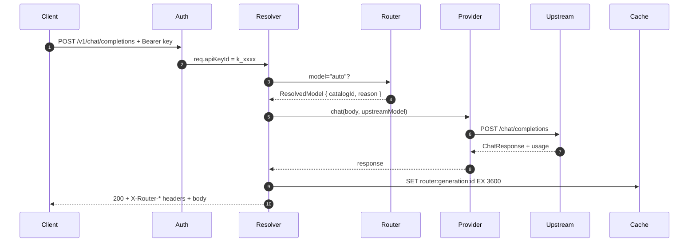
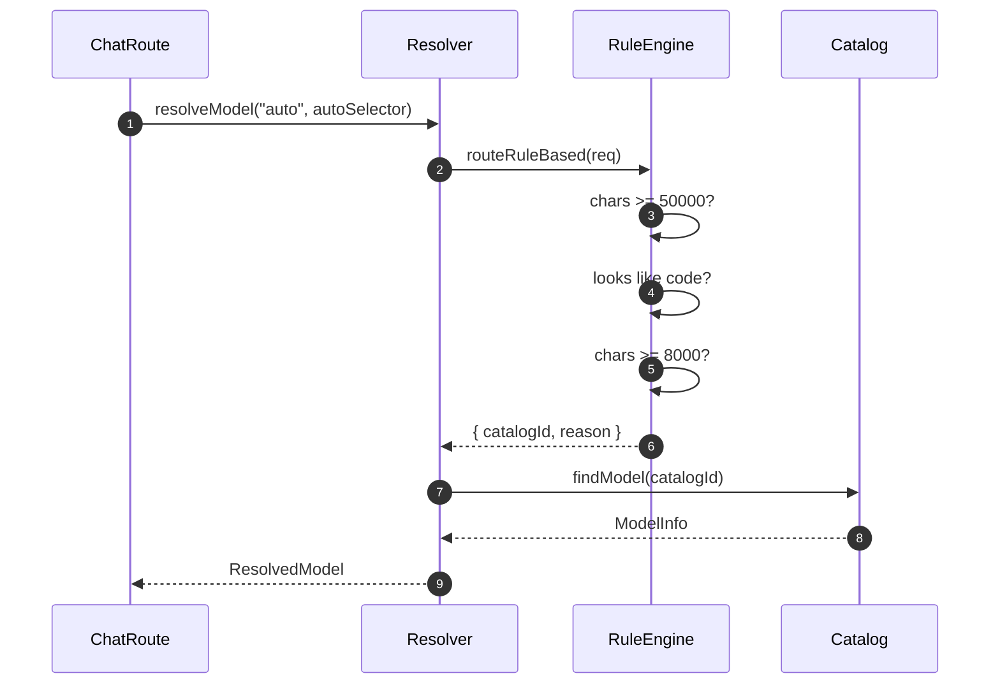
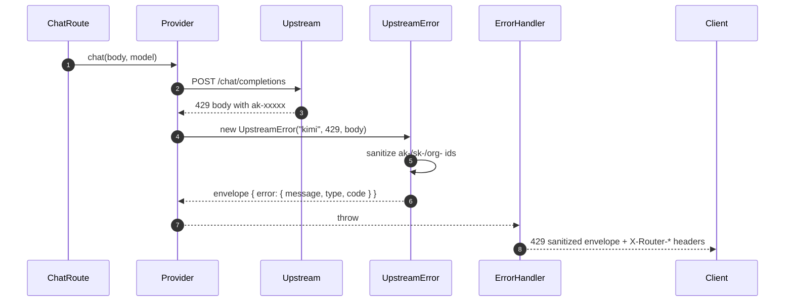

<p align="center">
  
</p>

<h1 align="center">roach-router</h1>

<p align="center">
  OpenAI-compatible  LLM gateway that routes between <b>Qwen</b> and <b>Kimi</b>.<br/>
  Drop-in <code>base_url</code> for the OpenAI SDK, LangChain, CrewAI, Agno.
</p>

<p align="center">
  
  
  
  
  
</p>

---

> **Viewing the diagrams.** All `mermaid` blocks below render as live SVGs on **github.com** and any Mermaid-aware viewer (GitLab, Obsidian, Notion, VS Code with the *Markdown Preview Mermaid Support* extension). In viewers without Mermaid the source shows as fenced code, which is still the canonical truth and editable in place.

---

## How routing decides

The gateway picks a provider per request based on **what's in the prompt** and **how the client asked**. Three inputs in priority order:



### What the router looks at

| Signal | How it's computed | Why it matters |
| ------ | ----------------- | -------------- |
| **Prompt size** | sum of `content.length` across all messages | long prompts need long-context windows (Kimi 128k) |
| **Code detection** | regex set over message content: \`\`\` fences, `function`/`class`/`import`/`def`, SQL `SELECT...FROM`, language names | code questions go to Qwen's code-specialized model |
| **Client intent** | `model` field on the request body | explicit ids and aliases trump heuristics |

### What it does **not** look at (yet)

These are slated for later phases — see `plan.md`:

- Embedding-based semantic similarity to past prompts (Phase 4)
- Live provider latency / error-rate signals
- Per-token cost minimization
- Tool-call complexity scoring
- Vision / multimodal hints

### Routing rules in source

The rules live in one file: `src/core/router.ts`. To change them, edit `routeRuleBased(req)` — it returns `{ catalogId, reason }`. The `reason` string is what shows up on every response as `X-Router-Reason` and in every log line.

```ts
// src/core/router.ts (excerpt)
if (chars >= VERY_LONG_CONTEXT_THRESHOLD_CHARS) {
  return { catalogId: "moonshot-v1-128k", reason: `very_long_context:${chars}` };
}
if (looksLikeCode(req)) {
  return { catalogId: "qwen3-coder-plus", reason: "code_detected" };
}
if (chars >= LONG_CONTEXT_THRESHOLD_CHARS) {
  return { catalogId: "moonshot-v1-32k", reason: `long_context:${chars}` };
}
return { catalogId: "moonshot-v1-32k", reason: "default" };
```

---

## High Level Architecture Overview



---

## Request Flow Overview



---

## Auto Routing Decision Flow



---

## Upstream Failure → Sanitized Envelope



---

## Endpoints

| Method | Path                       | Notes                                      |
| ------ | -------------------------- | ------------------------------------------ |
| `GET`  | `/health`                  | liveness                                   |
| `GET`  | `/ready`                   | reports cache connectivity                 |
| `GET`  | `/v1/models`               | OpenRouter-shaped catalog (cached)         |
| `POST` | `/v1/chat/completions`     | non-stream or SSE; tools passthrough       |
| `GET`  | `/v1/generation/:id`       | retrieve stats for a recent generation     |

## Models

Direct catalog ids: `qwen-turbo`, `qwen-plus`, `qwen-max`, `qwen3-coder-plus`, `moonshot-v1-8k`, `moonshot-v1-32k`, `moonshot-v1-128k`, `kimi-k2-0711-preview`.

Aliases:

| Alias  | Meaning                                |
| ------ | -------------------------------------- |
| `auto` | router picks per request               |
| `fast` | `qwen-turbo`                           |
| `smart`| `moonshot-v1-32k`                      |

`auto` rule-based routing:

- ≥ 50k chars of prompt → `moonshot-v1-128k`
- code detected → `qwen3-coder-plus`
- ≥ 8k chars → `moonshot-v1-32k`
- otherwise → `moonshot-v1-32k`

## Response headers

Every non-streaming completion (and the SSE preamble) carries:

```
X-Request-Id
X-Router-Provider     qwen | kimi
X-Router-Model        upstream model name
X-Router-Catalog-Id   gateway catalog id
X-Router-Reason       routing decision reason
X-Router-Latency-Ms
X-Router-Cost-Usd     (non-stream only)
```

## Run locally

```sh
bun install
cp .env.example .env       # fill QWEN_API and KIMI_API
bun index.ts
```

Listens on `http://localhost:3000`. Without `REDIS_URL` the gateway fails open — caching + generation lookup are disabled and a warning is logged.

## Run with Docker Compose

```sh
docker compose up --build
```

Spins up Valkey + the gateway. Env is read from `.env`. The router talks to Valkey over the compose network at `redis://valkey:6379`.

## Authenticated mode

Comma-separated list of API keys; clients must send `Authorization: Bearer <key>`:

```
ROUTER_API_KEYS=sk-yours-1,sk-yours-2
```

Each key gets a short fingerprint that is logged with every request. Plaintext keys are never logged.

## Testing

```sh
bash tests/run.sh           # 58/58 pass, spawns its own gateway
bunx tsc --noEmit           # type check
```

Manual probes:

```sh
curl localhost:3000/health
curl localhost:3000/v1/models | jq .

bash examples/curl/chat.sh
bash examples/curl/stream.sh
bash examples/curl/tools.sh

curl localhost:3000/v1/generation/<id-from-previous-response>
```

## Project layout

```
src/
├── config.ts                env loading
├── server.ts                fastify bootstrap + hooks
├── types.ts                 shared types
├── utils/{errors,ids}.ts
├── infra/
│   ├── logger.ts            pino options (redaction, serializers)
│   └── cache.ts             Valkey/Redis wrapper (fail-open)
├── core/
│   ├── catalog.ts           model catalog + aliases
│   ├── resolution.ts        request model -> ResolvedModel
│   ├── router.ts            rule-based auto routing
│   └── cost.ts              per-token cost calc
├── providers/
│   ├── base.ts              Provider interface
│   ├── openai-compatible.ts shared upstream client
│   ├── qwen.ts kimi.ts      instances
│   └── registry.ts          ProviderName -> Provider
└── api/
    ├── schemas.ts           zod
    ├── middleware/auth.ts   API-key gate
    └── routes/{chat,models,generation}.ts
examples/
├── curl/                    chat, stream, tools
├── langchain/               TS via @langchain/openai
└── crewai/                  Python via LiteLLM
tests/
├── lib.sh                   assertion helpers
├── 01..06-*.sh              focused test files
└── run.sh                   master runner
```

## Logging

Pino JSON, level via `LOG_LEVEL`. Dev (`NODE_ENV != production`) is colorized via `pino-pretty`. Every routed request logs at least once with `routed` (resolved model + reason) and once with `completed` or `failed` (latency, status, usage, cost). `req.headers.authorization` and provider API keys are redacted. No request bodies are persisted.

Generation stats are cached in Valkey for `GENERATION_CACHE_TTL_SECONDS` (default 1h) to power `/v1/generation/:id`.

---

## Deeper docs

- [`docs/OVERVIEW.md`](docs/OVERVIEW.md) — same diagrams as above, standalone
- [`docs/ARCHITECTURE.md`](docs/ARCHITECTURE.md) — 31 diagrams (C4, class, sequence, flow, state, ER)

<!-- BEGIN:RENDERED-DIAGRAMS -->

## Diagrams (rendered)

Image versions of every Mermaid block above — visible in any markdown viewer, no extension required.

### How routing decides


### High Level Architecture Overview


### Request Flow Overview


### Auto Routing Decision Flow


### Upstream Failure → Sanitized Envelope


<!-- END:RENDERED-DIAGRAMS -->
